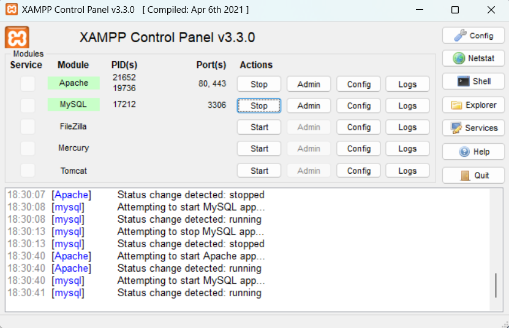
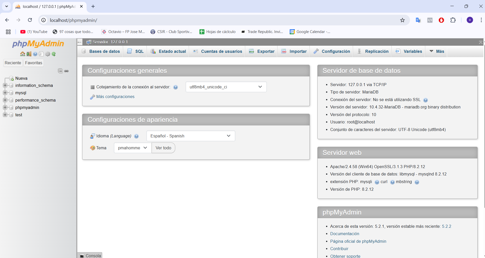
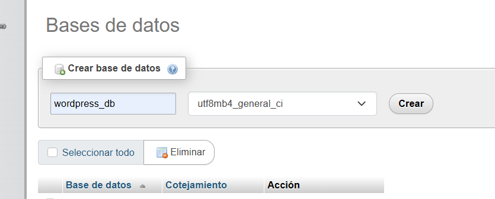
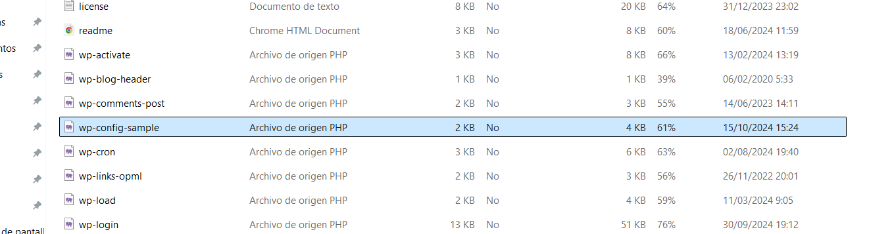
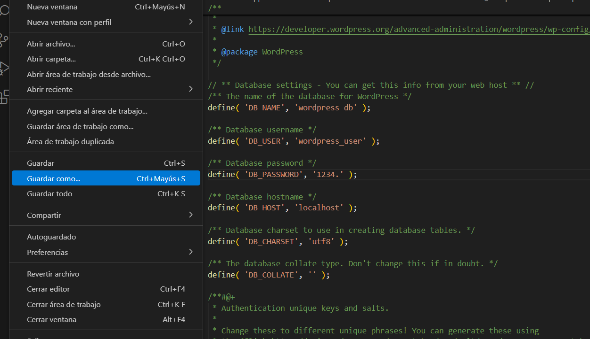
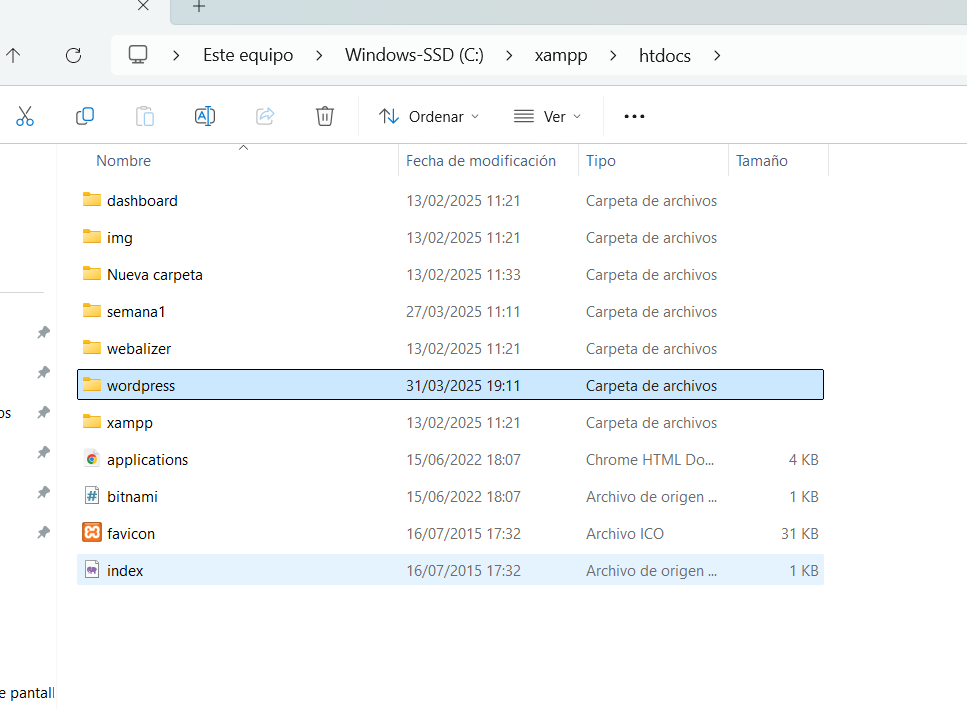
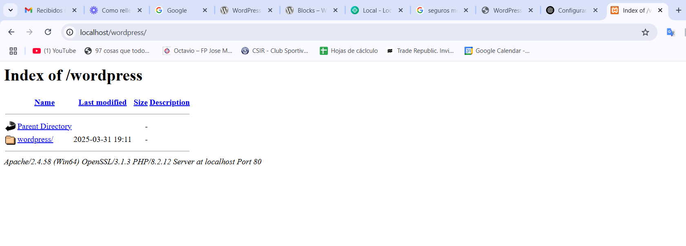
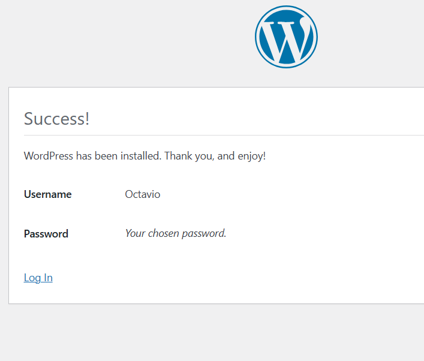
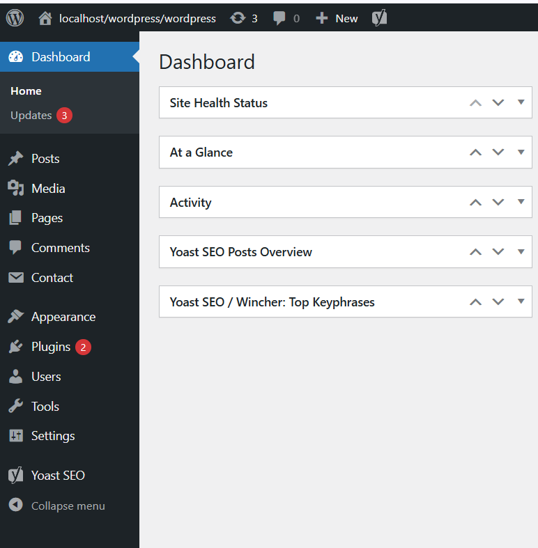

 Primero debemos activar Apache y MySql
 
 En phpMyAdmin debemos crear una base de datos
 
 
 Nos metemos en el archivo de la imagen.
 
 Modificamos los datos que se presentan en la imagen para que luego el programa entre en la base de datos que hemos creado. Ingresamos en Guardar como... y al archivo lo denominamos wp-config
 
 Guardamos la carpeta con el contenido de Wordpress en la carpeta htdocs.
 
 Una vez realizados todos los pasos anteriores colocamos en nuestro navegador la Url que se observa en la imagen y en la misma imagen se puede observar también un link que dice wordpress, clickeamos en tal link para comenzar la instalaciçon y configuración de nuestro programa.
 
 Creamos un usuario y contraseña y ya podemos utilizar Wordpress.
 
 En la barra lateral de la izquierda podemos observamos varias opciones donde las misma nos van a ir sirviendo para crear nuestra página web.
 En Post creamos las entradas para un Blog.
 En Page creamos las distintas páginas que van ir moldeando nuestro sitio web.
 En Contact, si previamente hemos descargado un plugin como este caso fue Contact Form 7, podemos agregar un formulario de contacto en nuestro sitio web.
 En Appaerance podemos encontrar los distintos temas que nos ofrece Wordpress como así también un editor de los mismo.
 En Plugins podemos buscar distintas aplicaciones que podemos agregar a nuestro Wordpress para que puedan facilitarnos el trabajo que queremos obtener.
 